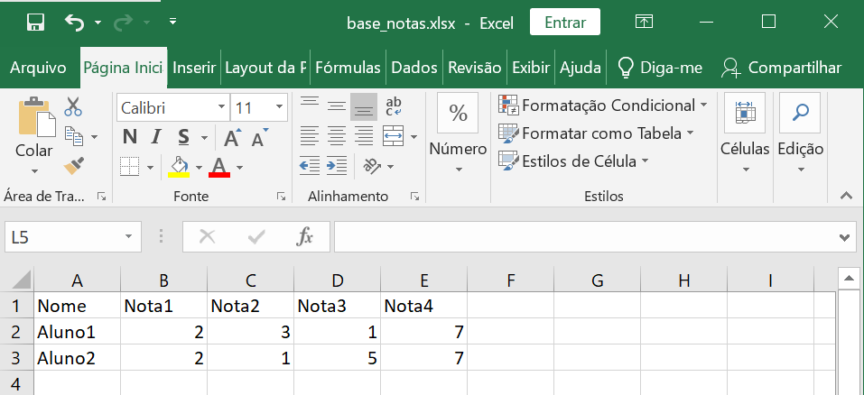

# Py
### Detalhes do Codigo
Panda é uma inteligencia artificial que fornece ferramentas para manipular e analisar dados, e pd é uma biblioteca que fornece ferramentas para análise e manipulação de dados.

```
import pandas as pd
```

base_notas.xlsx é o nome do seu excel e o nota_aluno.xlsx também, e df é o DataFrame do Pandas, é uma maneira de representar e trabalhar com dados tabulares.

```
df = pd.read_excel("base_notas.xlsx")
```

O excel que a inteligencia ira fazer.

```
df.to_excel('nota_aluno.xlsx', index=False)
```

### Codigo

```
import pandas as pd

df = pd.read_excel("base_notas.xlsx")

df['Media'] = df[['Nota1', 'Nota2', 'Nota3', 'Nota4']].mean(axis=1)

df.to_excel('nota_aluno.xlsx', index=False)

```

### Como ira ficar


### Porém
Antes de ficar assim, vai ter que criar um excel primeiro pra adicionar os componentes, ele adicionara a Media sozinho


## Referencias:
[README](README.md)

[Comandos Git](ComandosGit.md)
